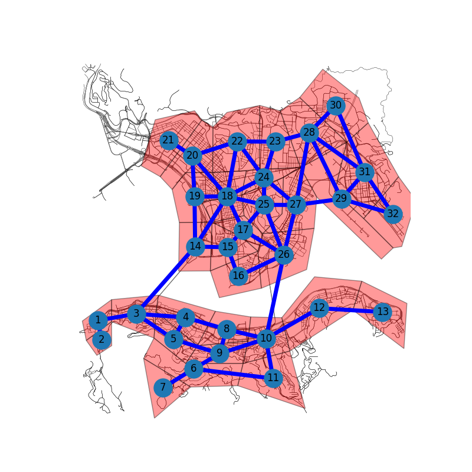

# Region partition dataset of Hong Kong city
Author: Kaihang Zhang

Last update date: July 1, 2023

This repository provide the region partition data of the Hong Kong city. 

The regions are manually demarcated, in the Hong Kong island and the Kowloon district, by selecting vertices and their coordinates (from Google map). The connectivity among regions is also manually identified, based on the author's personal knowledge with the help of Google map. 

The function of each region is also manually labeled, but they might be inaccurate though the author has tried his best, because the author has only lived in Hong Kong for around one year by the time this data is made. The funciton of each region can be three types, namely the business area (B), the residential area, and the merchant area (M). 

The number of restaurants in each region is provided, by extractign the data from OpenStreetMap (using the Python package osmnx).

The region partitioning results are recorded in the following files
- "polygon_verteces.csv": records the coordinates of the vertices of each polygon (each region)
- "polygon.csv": records the information of each region
- "edges.csv": records the links with a origin node and a destination node

The illustration of the partiioning results is as follows.

